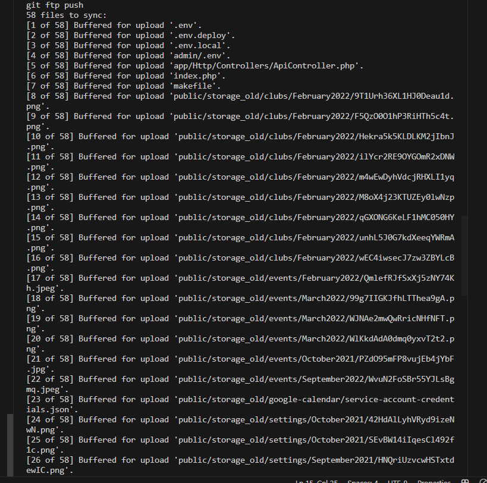
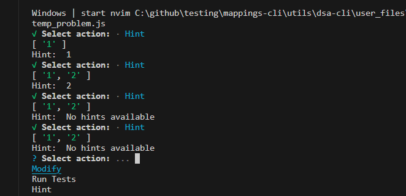

## 2 Monday

- [x] 2.1 Improve using Rollback
- [ ] 2.2 Do SLC Site Upload
- [x] 2.3 Remove Async from all to remove errors
- [x] 2.4 Adding feature to add insertion into the database with the markdowns and comments.


### 2.1 Improve using Rollback

Added Rollback Also removed async


### 2.4 Adding feature to add insertion into the database with the markdowns and comments.

- [x] Designing the data being sent:
- [x] Create the models
- [x] Create the file Upload
- [x] Test the file upload implement the models


```json
{
    "comments": [], //Array of all comments so far.
    "code_url": "", // S3 URL of the code
    "language": "js",
    "date": datetime,
    "attempt_counts": int,
    "is_correct": bool, 
    "problem_slug": "problem-slug", // The slug of the problem
    "user_id"
}
```


Lets see if this 


- Now lets have the mapping for things done
- First have the posting of the code as an `option` in the menu
- Then also automatically once the code is fnished.


A rimworld like Adventurers game.

Where instead you move your character. as if it were bannerlord. Simple strategies like:

- Attack
- Retreat to Me (Backline)
- Round to me


Then you can configure the armies position on your own.

I think something that would make sense would be some kind of `Mercenary simulator`

Where you form a band of mercenaries to combat.

- Te idea is that you build your army with people from the unit according to your distinctions nd values/
- Then also have traits such as morality etc
- You start being drafted.
- And the idea is that people join you
- Or you have the permision to create an army
- You can start like: a draftee => Starts in middle of combat with barely any weapons
- An artisan => Building for weapons
- A farmer => Drafted => Basic weapons. Your town is raided.
- A noble => Family of warriors, starts with high combat stats


```js
populateTemplate(problem, {base=""} = {}) {
    if (DEBUG) console.log("Populating template with ", problem, " and base ", base);
    if(base != "") {
        return this.copyFileToTemp(problem.file_path, {base: base});
    }
    this.copyFileToTemp(problem.file_path);
}
```


We knwo that the base is there.


But as can be seen here is not there:


Base is usually empty?

Oh here it is


```js
// Replace 'file_path' with the actual path to your file
const filePath = 'path/to/your/file.txt';

// Create a FormData object to store the file
const formData = new FormData();
formData.append('file', new Blob([fs.readFileSync(filePath)]), 'file.txt');

// Replace 'upload_url' with the URL where you want to upload the file
const uploadUrl = 'https://example.com/upload';

// Make a POST request to the server
fetch(uploadUrl, {
  method: 'POST',
  body: formData,
})
  .then(response => {
    if (response.ok) {
      // File successfully uploaded
      console.log('File uploaded successfully');
    } else {
      // Handle the error
      console.error('File upload failed');
    }
  })
  .catch(error => {
    // Handle network errors
    console.error('Network error:', error);
  });

```


Doesnt look like it requires for absolute path:


```js

if (DEBUG) console.log("Getting temp_file_path from ", this.temp_problem_filepath);
delete require.cache[require.resolve(this.temp_problem_filepath)] // delete the cache of the file
const { Problem } = require(this.temp_problem_filepath);
```


```bash

Error: ENOENT: no such file or directory, open './user_files/temp_problem.js'
at Object.openSync (node:fs:585:3)
at Object.readFileSync (node:fs:453:35)
```


```js
const uploadCodeMetadataUrl = 'http://127.0.0.1:8000/utils/upload_file';
        
```


Now lets try fix the following:


```js

const metadata = {
    "comments": [],
    "code_url": file_url,
    "language": "javascript",
    "date": getCurrentDate(),
    "attempt_counts": 0,
    "attempt_timestamps": [],
    "is_correct": true,
    "problem_slug": problem.slug,
    "account_id": constants.CONSTANTS.ACCOUNT_ID
};

```
- [x] Adding the correct attempt_timestamps whenever the count increases
- [x] Create the variable

Now we want to also 


Now it works so lets see:


- We should also do the following
  - [x] Adding points automatically
  - [x] Checking if show solution was clicked => Can be added to database but not really makes much sense
  - [x] Modifying the local to have the actual url


### Modify the local to have the actual url

Done

### Adding points automatically

- But make it now that only if either is working
- Or there exists comments


### Fixing SLC Site Upload

```php
protected static function formatPrefix($new, $old, $prependExistingPrefix = true)
{
$old = $old['prefix'] ?? null;

if ($old !== null) {
    $old = trim($old, '/');
}

if ($prependExistingPrefix) {
    return isset($new['prefix']) ? $old.'/'.trim($new['prefix'], '/') : $old;
} else {
    return isset($new['prefix']) ? trim($new['prefix'], '/').'/'.$old : $old;
}
}
```

## 4 Wednesday

### 4.todo

- [ ] 4.1 Using a combination of Matplot lib and python create a library that:
  - [ ] supports different data strucutres operations
  - [ ] Creates automatically gifs for them.
  - [ ] Start with an array type.


Eventually I want it to also Create a libray the following that asks you to compelte using python: (Or an addon option for Js)

- Matplot and Data Science Questions
- Becoming a wiz for Matplot
- and df operations as well as other data science libraries would come great for your career.
- 


### Improving the loading speed of maid


Now is so goddamn fast!

Note this is how they are initialized
```js
        const clozeScheduler = new TermScheduler({
            cards: cloze_problems,
            cards_category: "Algo"
        });
        await clozeScheduler.setLearningCards(cloze_problems);
```


```js

express
markdown-it-toc-done-right
"esm": "^3.2.25",
```


### Make it so that if it contains an image url then attempt to search it.


### Design the hint system

- Hints could just be comments or even watching whats there
- OR displaying the images
- My guess is that they should be an array of strings (So to be easily supported on markdown)

If they are an thml url then display the image (likely to be the image, otherwise just show the comment)

- [ ] Build the comment shower example
  - [ ] The idea for hint just to show the comments for now
  - [ ] 

['']


 - [x] Also has to be submitted on submit always - Nah not necessarily right?

- [ ] Add the hint example
- [ ] Try to check how is being read


Lets hope this is enough supposing is there

```js

this.addProblem(new ProblemMetadata(problem, {
    tags: problem_prompt.tags, difficulty: classifyDifficulty(problem_prompt.tags),
    name: problem_prompt.title, description: problem_prompt.description, link: problem_prompt.link,
    hints: problem_prompt.hints
}));

```


This seems to automatically have the prompts there
```js
const createCompiledJson = () => {
    let parsed_prompt_dict = {};

    getFilesInDirectory('./prompt/')
        .then((files) => {
            const absolutePathForFiles = files.map((file) => {
                return getDirAbsoluteUri(file, './prompt/');
            });
            if (DEBUG) console.log("absolutePathForFiles: ", absolutePathForFiles);
            const promptsData = md2json.parse(absolutePathForFiles, options);
            if (DEBUG) console.log(promptsData);
            parsed_prompt_dict = JSON.parse(promptsData);

            // Save as a json
            const json = JSON.stringify(parsed_prompt_dict);
            const prompt_file_path = getDirAbsoluteUri(PROMPT_FILE, './prompt/');
            fs.writeFile(prompt_file_path, json, (err) => {
                if (err) throw err;
                console.log('The file has been saved!');
            });
        })
        .catch((error) => {
            console.error(error);
        });
};

```


Whats breaking the Upload?




```bash

C:\github\testing\admin.brooklynslcouncil.com\SLC-ADMIN>make merp "deployment cred" 
git add --all
git commit -m "Deployment" 
[deployment 49f0dc1] Deployment
 1 file changed, 13 insertions(+)
git push origin HEAD
Enumerating objects: 5, done.
Counting objects: 100% (5/5), done.
Delta compression using up to 12 threads
Compressing objects: 100% (3/3), done.
Writing objects: 100% (3/3), 437 bytes | 437.00 KiB/s, done.
Total 3 (delta 2), reused 0 (delta 0), pack-reused 0
remote: Resolving deltas: 100% (2/2), completed with 2 local objects.
To https://github.com/Koppelman-Student-Leadership-Council/SLC-ADMIN.git
   451e6d2..49f0dc1  HEAD -> deployment
make ft-push
make[1]: Entering directory 'C:/github/testing/admin.brooklynslcouncil.com/SLC-ADMIN'
git ftp push
58 files to sync:
[1 of 58] Buffered for upload '.env'.
[2 of 58] Buffered for upload '.env.deploy'.
[3 of 58] Buffered for upload '.env.local'.
[4 of 58] Buffered for upload 'admin/.env'.
[5 of 58] Buffered for upload 'app/Http/Controllers/ApiController.php'.
[6 of 58] Buffered for upload 'index.php'.
[7 of 58] Buffered for upload 'makefile'.
[8 of 58] Buffered for upload 'public/storage_old/clubs/February2022/9T1Urh36XL1HJ0Deau1d.png'.
[9 of 58] Buffered for upload 'public/storage_old/clubs/February2022/F5QzO0O1hP3RiHTh5c4t.png'.
[10 of 58] Buffered for upload 'public/storage_old/clubs/February2022/Hekra5k5KLDLKM2jIbnJ.png'.
[11 of 58] Buffered for upload 'public/storage_old/clubs/February2022/ilYcr2RE9OYGOmR2xDNW.png'.
[12 of 58] Buffered for upload 'public/storage_old/clubs/February2022/m4wEwDyhVdcjRHXLI1yq.png'.
[13 of 58] Buffered for upload 'public/storage_old/clubs/February2022/M8oX4j23KTUZEy0lwNzp.png'.
[14 of 58] Buffered for upload 'public/storage_old/clubs/February2022/qGXONG6KeLF1hMC050HY.png'.
[15 of 58] Buffered for upload 'public/storage_old/clubs/February2022/unhL5J0G7kdXeeqYWRmA.png'.
[16 of 58] Buffered for upload 'public/storage_old/clubs/February2022/wEC4iwsecJ7zw3ZBYLcB.png'.
[17 of 58] Buffered for upload 'public/storage_old/events/February2022/QmlefRJfSxXj5zNY74Kh.jpeg'.
[18 of 58] Buffered for upload 'public/storage_old/events/March2022/99g7IIGKJfhLTThea9gA.png'.
[19 of 58] Buffered for upload 'public/storage_old/events/March2022/WJNAe2mwQwRricNHfNFT.png'.
[20 of 58] Buffered for upload 'public/storage_old/events/March2022/WlKkdAdA0dmq0yxvT2t2.png'.
[21 of 58] Buffered for upload 'public/storage_old/events/October2021/PZdO95mFP8vujEb4jYbF.jpg'.
[22 of 58] Buffered for upload 'public/storage_old/events/September2022/WvuN2FoSBr55YJLsBgmq.jpeg'.
[23 of 58] Buffered for upload 'public/storage_old/google-calendar/service-account-credentials.json'.
[24 of 58] Buffered for upload 'public/storage_old/settings/October2021/42HdAlLyhVRyd9izeNwN.png'.
[25 of 58] Buffered for upload 'public/storage_old/settings/October2021/SEvBW14iIqesCl492f1c.png'.
[26 of 58] Buffered for upload 'public/storage_old/settings/September2021/HNQriUzvcwHSTxtdewIC.png'.
[27 of 58] Buffered for upload 'public/storage_old/settings/September2021/idwZBanoXdK1VjQ6q2ED.jpg'.
[28 of 58] Buffered for upload 'public/storage_old/settings/September2021/uvCE3WytoozUvFKOpHnb.jpg'.
[29 of 58] Buffered for upload 'public/storage_old/teams/February2022/AdAIbkp3DQ4O4SGjlb87.png'.
[30 of 58] Buffered for upload 'public/storage_old/teams/February2022/BcZq0hTbwTxqWsj7xXDX.png'.
[31 of 58] Buffered for upload 'public/storage_old/teams/February2022/BK2QBiSds9qtSOYC9R3Y.png'.
[32 of 58] Buffered for upload 'public/storage_old/teams/February2022/K5CIA6wtV9tELm6Vjb2T.png'.
[33 of 58] Buffered for upload 'public/storage_old/teams/February2022/NnKiviFy6qzUfVrZpuux.png'.
[34 of 58] Buffered for upload 'public/storage_old/teams/February2022/ORNn5mVBtzLKORb73Wo1.png'.
[35 of 58] Buffered for upload 'public/storage_old/teams/February2022/qq99IDKMGEf7ARJLRUCa.png'.
[36 of 58] Buffered for upload 'public/storage_old/teams/March2022/d2jdcUWri84dqqkHEvVs.png'.
[37 of 58] Buffered for upload 'public/storage_old/teams/March2022/DSC47w0pXbSVnM9CpZ3J.png'.
[38 of 58] Buffered for upload 'public/storage_old/teams/March2022/E7wOx0oE0DVNai8CKQny.png'.
[39 of 58] Buffered for upload 'public/storage_old/teams/March2022/HR0ryw1AqYwtvclekEvI.png'.
[40 of 58] Buffered for upload 'public/storage_old/teams/March2022/Kj7QVkrQgpRdcJgMVaw3.png'.
[41 of 58] Buffered for upload 'public/storage_old/teams/March2022/V23TmEHuk4tP3tXsbxVd.png'.
[42 of 58] Buffered for upload 'public/storage_old/teams/March2022/xRsiP9TGXgRvmicw76g1.png'.
[43 of 58] Buffered for upload 'public/storage_old/teams/March2022/YMTRGRPmTHPiXOlEFZaN.png'.
[44 of 58] Buffered for upload 'public/storage_old/teams/November2021/RdeKCRQ0e6IvJmqhxTj9.png'.
[45 of 58] Buffered for upload 'public/storage_old/teams/October2021/dPyearqROySg3CD3J9Ni.png'.
[46 of 58] Buffered for upload 'public/storage_old/teams/October2021/r3mR6yzdy7pnpb5WArFF.png'.
[47 of 58] Buffered for upload 'public/storage_old/teams/October2021/waxn0qsYVagMa6gwsxkc.png'.
[48 of 58] Buffered for upload 'public/storage_old/teams/October2021/x62Q3HZeRnAj5jnc7J25.png'.
[49 of 58] Buffered for upload 'public/storage_old/teams/October2021/XuARh7CQszWQJ4fd0oOn.png'.
[50 of 58] Buffered for upload 'public/storage_old/teams/October2022/5e8Lm3B5s0LNOwJ1qs7F.jpg'.
[51 of 58] Buffered for upload 'public/storage_old/teams/September2022/j3HjruymS23EF3UeLiid.jpg'.
[52 of 58] Buffered for upload 'public/storage_old/teams/September2022/rv3nlzMaAGbnQfowImfU.JPEG'.
[53 of 58] Buffered for upload 'public/storage_old/teams/September2022/XegZeYnPnpPFZiBv6ZFa.jpg'.
[54 of 58] Buffered for upload 'public/storage_old/users/default.png'.
[55 of 58] Buffered for upload 'public/storage_old/users/September2021/HEEh0VyexGYQy0XZ61cb.png'.
[56 of 58] Buffered for upload 'README.md'.
[57 of 58] Buffered for upload 'routes/api.php'.
[58 of 58] Buffered for upload 'vendor.zip'.
```


Why would this even disroupt anything?


### 5 Thursday


### 8.todo

- [x] 8.1 Adding basic hint system
- [x] 8.2 Adding hint image lookup system for https
- [ ] 8.3 Adding more wiki images to the maid cli.
- [ ] 8.4 Adding the SLC body of contents


### 8.1 Adding basic hint system



```js
"Hint": async () => {
    // TO Complete
    let hintsMssage = "No hints available";
    if(hintsGiven.length + 1 < problem.hints.length){
        hintsMssage = problem.hints[hintsGiven.length];
        hintsGiven.push(hintsMssage);
    }
    question_state_flag = true;
    
    console.log(hintsGiven)
    console.log("Hint: ", hintsMssage);

},
```

That's Incorrect:


```js
if(hintsGiven.length < problem.hints.length)
```

Here a better one.

### 8.2 Adding hint image lookup system for https


### 8.3 Adding more wiki images to the maid cli.

- [ ] Uploading the gifs 


### 8.4 Adding the SLC body of contents

- [ ] Adding the body from the SLC siteN


## 10 Fri

#### 10.todo

- [ ] 10.1 Doing you d Leetcode.
- [ ] 10.2 Analysing the dataset of the J market


### 10.1 Doing you d Leetcode.


## 14 Sat

- [x] Developing the Contact Links
- [ ] Adding the google nextjs links
- [ ] Adding the Our Featured Works


