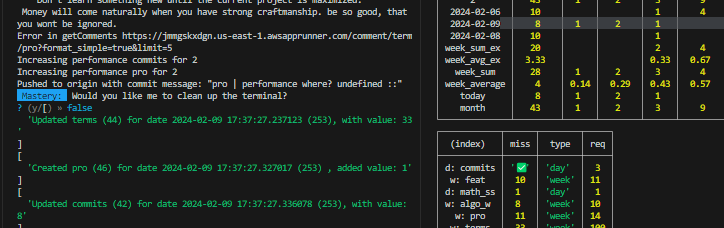
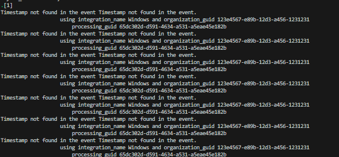

## 9 Friday

### 9.todo 

- [x] 9.1 Gathering some thoughts about the Hackathon
- [ ] 9.2 Finishing the feat based Radar graph. 
- [ ] 9.3 Start working on Decks Sharing System
- [ ] 9.4 Plan a plan for learning algorihtms better
- [ ] 9.5 Draft a plan for social at hack
- [ ] 9.6 Build the Lang Chain system.
- [ ] 9.7 Build Simple React Native Expo Template
- [ ] 9.8 Rough development using `Angular` for Maid-CLI's Project 
- [ ] 9.9 Explore Sentiment Analysis
- [ ] 9.10 Prepare everthing for Ferrnando to test your application.


### 9.1 Gathering some thoughts about the Hackathon

What I am thinking here, the likehood of the best tool to develop here would be something that were to combine the following stack

- Langchain: For LLM features.
- React Native: I need it on my portfolio to build things.
- Some random backend is good enough.

- You dont need to setup user whatever but would definitevely be a plus.


**Planning Socially Speaking**

- This shouldnt take priority over meeting people. You might want to print your resume and get to get pass as one of the students there. The idea is to strike friendly converations meet talented people. Probably aim to keep contact with them.
What would make people like you?

- Not being a jerk/sending memes. being friendly and hear people out
- Also try to optimize for this: Skilled People + People likelier to invite you.
  - If they looking for internship you can ask if you want them you to ask your manager.
  - Look for asians and seniors that they share the same interests as you. If they come from some shty school that might even be better.
- Also in the end try to go though others projects and learn more about them. 
- Sticking and working the project throughky
- Staying the night for the Hackathon
- Help over the design of the project.
- Being positive and attempt to stick out with other's ideas. (helping talented people buidl the ideas)
- Probably try to find male friends to hang out with.
- Ask for linkedings. Ask if anyone looking for internships you can ask your manager. Say is paying double around $30 which makes sesnse sicne you are being paid double for part-time.
- Try to connect with that bc guy, who seems very promising in participation + algorithms.

**Review the project stack.**


### 9.2 Finishing the feat based Radar graph.


- For this which are the features I am asking for?
  - I would be asking, for `pro` `math` `term`?

But honestly I think I stopped tracking term and math. So the focus should be instead of: `pro` `feat` and perhaps `algo` and `algo_w` ?

`pro` `algo_w` `feat`


And the idea is to have them weekly since they have a miss feature, that should also be used as the cap for the weeks requirements.

- Lets try first in hardcoded way. Never mind beacuse they are propportional, they should work while we support having. 
- [x] Lets actually care for commits and cards regardlesss.
- [x] Make the performance increase b the typen
- [ ] Ensure that the database is fetching from the current year.

Which api is being requested?

```py
this_week_dates = [ today_date - datetime.timedelta(minus) for minus in range(1, 7)]

for performance in performances:
    
    performances_date = performance.daily_performances # List of daily performances
    for date_performance in performances_date:

        if this_month:
            performanceReport = distrubuteFeatsByMonth(selected_month=today_month, 
                feature=performance.title, date_performance=date_performance, performanceReport=performanceReport
            )

        if get_today:
            performanceReport = distributeFeatsByDate(selected_date=today_date, 
            date_performance=date_performance, feature=performance.title,  performanceReport=performanceReport 
            )

        if this_week:
            # print("Running this week with", this_week_dates)
            performanceReport = distributeFeatsByDates(selected_dates=this_week_dates, 
            date_
```

Right this doesnt make sense:

```py

    db.rollback()
    user_data = db.query(models.Account).filter(models.Account.id==account_id).first()
    performances = user_data.performances

    performances_formatted = getPerformanceForDate(performances)
    return performances_formatted
```

Just get them 


From the account

```py


@app.get('/account/report/{account_id}', tags=['Account'])
def getReport(account_id: str):
    """
    Gets the report based on the account id which should always be one to be honest.
    """
    db.rollback()
    user_data = db.query(models.Account).filter(models.Account.id==account_id).first()
    performances = user_data.performances

    performances_formatted = getPerformanceForDate(performances)
    return performances_formatted


```


This is what fascinates me:





```py

```

This is absolutelly insane, because it means that is creating the pro term for the user all the time. Whihc means there is no selection for pro. But pro dues acutlaly is being having with the smae user you have 

- cant find the date_selected.di with the performance_id for that user_account. Which is what makes sure that the system is consistent?

Lets check on the db table. But to the surprise the pro, is actually being updated in such a way tthat is queriable. Some might be more of a dynamic case but that should be okay.

Lets now try to build the cahrting operations for the system.


This method seems perfect to me:

  date_selected = getDayByDate(date=today)

  But it seems that tis not shared when querying for the dates.


```py

@app.get('/account/report/{account_id}', tags=['Account'])
def getReport(account_id: str):
    """
    Gets the report based on the account id which should always be one to be honest.
    """
    db.rollback()
    user_data = db.query(models.Account).filter(models.Account.id==account_id).first()
    
    db.execute("SELECT * FROM performance ")

    # Filter performances of this year only
    

    performances_formatted = getPerformanceForDate(performances)
    return performances_formatted

```

## 15.Thursday


### 15.todo

- [x] 15.1 Make the cursor work?
- [ ] 15.2 Publishing and Making Sure I am using the Correct API.


### 15.1 Make the cursor work?

```
SELECT id FROM organization WHERE guid = '123e4567-e89b-12d3-a456-1231231'
```

It seems that I was supposed to run curor.execute and then cursor.fetchall() to get the results.

### 15.2 Publishing and Making Sure I am using the Correct API.

- Wasn't I using a different api on the past?

## 20. Tuesday

### 20.todo

- [x] 20.1 Complete the Adapting system for Windows
  - [x] Test
- [x] 20.2 Complete the Adapting system for Email
  - [x] Test
  - [x] Fix Check all Identities instead of per platform. 
- [x] 20.3 Complete the adapting system for Chrome Connectors
  - [x] Test
- [x] 20.4 Clean the UI, Make sure it is feasible given latest iteration of the models.
- [x] 20.5 Finish Script presentation
- [ ] 20.6 Do all ses for Algorithms and Datastructures.
- [ ] 20.6.1 Consider publishing all docs internally instead by using github pages.
- [ ] 20.7 Brainstorm, how to, combine the studies + 5 minutes break successfully. (Whats the balance for doing sports instead?? How about the Gym? )
- [ ] 20.8 Continue working on support for multiusers in DSA.
- [ ] 20.9 How will you balance now with Also the hackathon + the work + the gym + the studies + Codepath + Algorithms and any fellowships + Completing self projects + Interview prep?
  - [ ] Blocking your time, and doing exactly how you blocked might help. Consider doing that on na Excel.
  - [ ] For applications, I would stop rn. to focus on the above mentioned. But the ideal is that if they are sinergized work together. The ideal is for exmaple if doing one can be done overlapping the other. Or both work hand on hand.
- [ ] 20.10 Design Mastery Onboarding system.
  - [ ] Diagram the Flow
  - [ ] Create the necessary API to populate default Settings. (Just overwrite the settings. And ask for user changing such as VIM or Code (Visual Studio.))
  - [ ] Reconsider taking back the Angular Project to include blogs and tutorials about the courses that you actulaly care about.


### 20.1 Complete the Adapting system for Windows

- [x] 20.1.1 Test

Is mostly developed, now you need to on the testings.



> Timestamp seems not to be found there.

So it seems to be a bug related to whenever the timestamp and the end_time is the same. The while loop would skip it.

Now that I fixed that: Here it states the following error:

```py

self = <test_adapters.TestAdapter object at 0x000001DDB2BCD6D0>
job_service = <processing_engine.job_service.JobService object at 0x000001DDB2CB5E20>

    def test_adapts_windows(self, job_service):
        windows_integration_adapter = WindowsIntegrationAdapter()
        sample_events = json.load(open('tests/data/events_windows.json'))

>       adapted_events: List[EventData] = windows_integration_adapter.adapt(sample_events, job_service)
```

```bash
processing_engine\processing_abstract.py:180: in checkConsistency
    end_time = parse(eventData.end_time)
C:\Users\NelsonWang\anaconda3\lib\site-packages\dateutil\parser.py:748: in parse
    return DEFAULTPARSER.parse(timestr, **kwargs)
_ _ _ _ _ _ _ _ _ _ _ _ _ _ _ _ _ _ _ _ _ _ _ _ _ _
```

It seems the cause to be on the parsing side. Where it attempts to parse `end_time`.


Lets see here where the:

### 20.2 Complete the Adapting system for Email


It seems that there were some cases in which if the duration was 0: Python would return none. because the question was eventData.duration:

```py

if eventData.end_time is None or eventData.duration is None:
    return None
```

> Here you can see that isntead we should use `None`.


### 20.3 Complete the adapting system for Chrome Connectors


