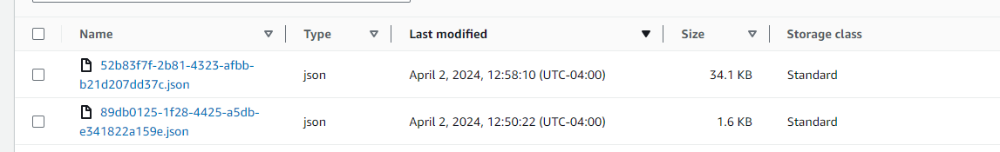

## 2 Tuesday

### 2.todo

- [ ] 2.1 Show using Chrome all credentials received and applied.
- [ ] 2.2 Review Antonio's Code
- [ ] 2.3 Review Proposal to have Chrome Stipplo with keywords checker.
- [ ] 2.4 Review into Genetic and Continue.
- [ ] 2.5 Adding all books algorithms learnt so far into anki.

### 2.1 Show using Chrome all Credentials received and Applied

### 2.2 Review Antonio's Code

#### Test 1
Actions
- [x] 15:57 Start typing in Obsidian
- [x] 15:58 Continue typing in Obsidian
- [x] 15:59 Break in the middle into a different application
- [x] 16:01: Finish so that to see the events.

Expectations
- [ ] 15:58 mid: an event indicating 15:57:xx - 15:57:59
- [ ] 15:59 mid: event indicating 15:58:00 - 15:58:59
- [ ] 16:00 mid event indicating 15:59:xx - 15:59:xy Obsidian

Sent at: April 2, 2024, 10:57:51 (UTC-04:00)
+ With some events from the past together.

- Sent at: April 2, 2024, 10:59:25 (UTC-04:00)

**What I received and conclusions**

I can see the following fixes were implemented:
- The event and attached interactions and the new interactions per minute are correct
- Event name and windows title seems to be  correct
Here are some issues remaining/new:
- a new event should have been sent every minute (new)
- the end_date of the event should been the last second of that minute e.g. `2024-04-02T14:56:59Z` instead of `0001-01-01T00:00:00`

#### Test 2 - Longer Obsidian Writing

**What I did**

11:40 Start Writing in Obsidian
Continue typing in Obsidian from 11:40 to the middle of 11:48
11:48 Finish Writing change pages

**What I expected**

- Around 8-9 staging events sent
- Each minute form 11:40 to 11:48 to receive an update regarding my typing
- At around 11:49 Receive my last event containing (The long action of) Obsidian.

**What I received**

- 2 staging events only
- The long Obsidian Event with updates (should be around 8-9 events) are missing

Thus, around 11:49 I would expect the last Obsidian Event to be sent.

This doesn't make much sense:

> This is incorrect around 8 events to be sent once every minute (random seconds)

Event Sent at: April 2, 2024, 11:41:50

> Here older events.

Event Sent at: April 2, 2024, 11:50:14

Last event:

> The event_date of event type: "WIN_AGENT_START" should be in UTC (Is in Local timestamp)

#### Test 3 - 

**My Actions:**
--- Test 3 ----

12:47: Start writing in Obsidian
Continued Typing in Obsidian until half of 12:5
12:57 Swapped to Firefox.
12:59 Stop sending events.

**Expected:**

- Around 10-12 Staging Events being sent to bucket
- Every minute to receive an event containing Obsidian, with updates of how are things working (From 12:48 to 12:58)
- at 12:58 receiving some mixture of events containing the last Obsidian Update + other events

**What I received**

- 2 Staging Events being sent to the bucket
- The long Obsidian event with updates is missing (the 10 files and events from 12:48 to 12:58)
- I have attached the json files received.

### 2.3 Review Proposal to have Chrome with keywords checker.

It should contain create a prototype to have the following on Chrome Extension

- Be able to check the keywords (skill words) on the selected description.
- Be able to create a 
- Be able to track the application
- Be able to take notes on the application.

It would also be quite the interesting side project for it.

You could event make the trading tool as a side project to have it 

